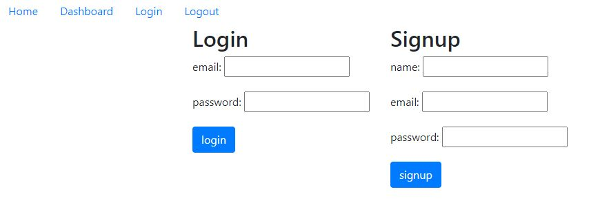

# Blog

  ## Description

  This web app is a blog site I made from scratch. It allows you to have an account and to make posts and comment on them.
  
  ## Table of Contents

- [Description](#description)
- [Installation](#installation)
- [Usage](#usage)
- [Questions](#questions)

## Installation

In CLI type :
```
npm install
```

## Usage

The app is for making posts to a blog site. IT will mainly be used as a bare bones blog site for now.

Deployed web app: [https://pure-refuge-14936.herokuapp.com/](https://pure-refuge-14936.herokuapp.com/)

## Images





## Questions

If you have any questions you can find me on Github at [m-ray-ofSunshine](https://github.com/m-ray-ofSunshine)


